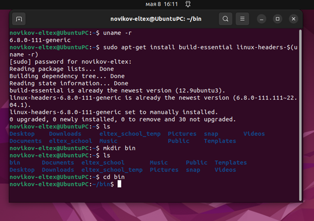
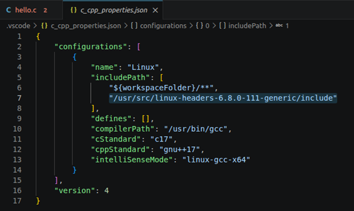
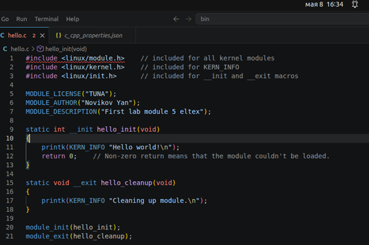
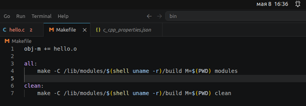
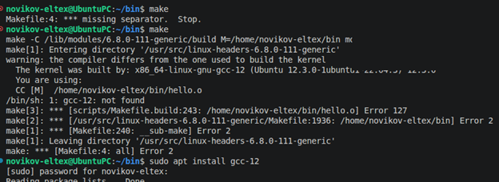
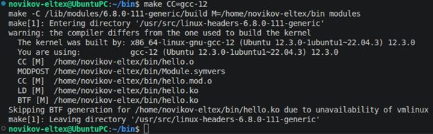
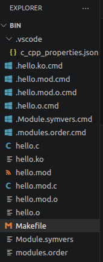
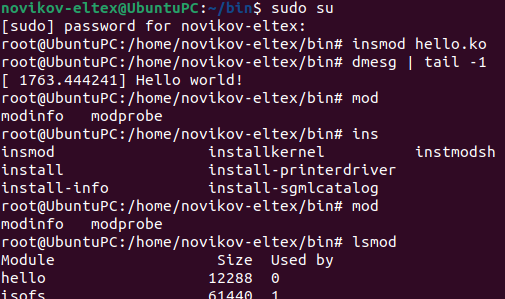
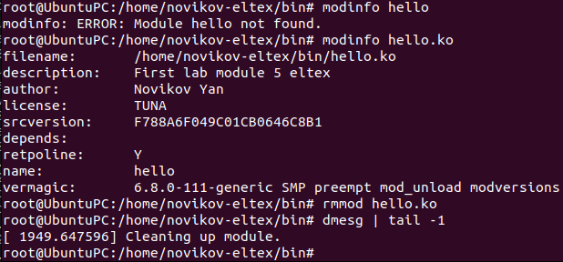

# Lab1, Module 5, Novikov

Для начала посмотрим на версию ядра и установим всё необходимое для неё. Также создадим папку bin в домашней директории, где и будет находиться модуль.

Переходим к написанию кода модуля. Перед этим в конфигурационном файле VS Code явно укажем путь к linux-headers include. Это нужно для того, чтобы VS Code нашёл необходимые библиотеки.

Код пользовательского модуля представлен ниже. Мною были изменены строки с лицензией, автором и описанием.

Теперь напишем Makefile для сборки модуля.

Теперь с его помощью соберём модуль. При сборке вышло пара ошибок. Первая ошибка возникла из-за того, что вместо табуляции стояло четыре пробела. Вторая из-за того, что использовалась неверная версия компилятора. Поэтому была установлена необходимая версия.

Когда всё починено, повторно выполним сборку модуля с явным указанием версии компилятора. В результате было создано множество файлов, в т.ч. необходимый нам hello.ko.

Далее переходим в режим root и принудительно загружаем собранный нами модуль hello.ko в ядро ОС. В результате в логи ядра нашим модулем было выведено сообщение, а также он был добавлен в список всех модулей.

Теперь посмотрим более подробную информацию о нашем модуле.

Строки с описанием, автором и лицензией соответствуют тем, что были указаны в коде. Также при удалении модуля из ядра в логи выводится соответствующее сообщение. Модуль обработал корректно, работа выполнена.