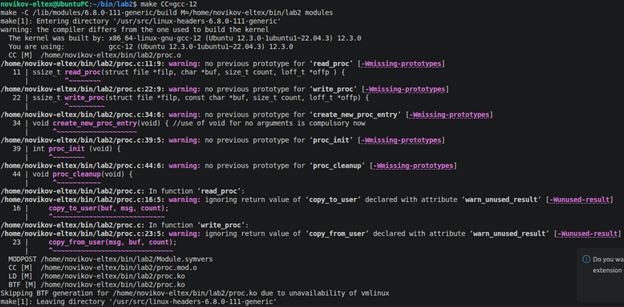
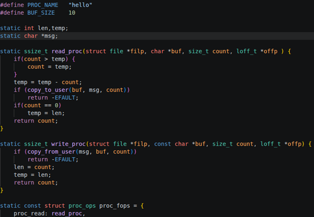
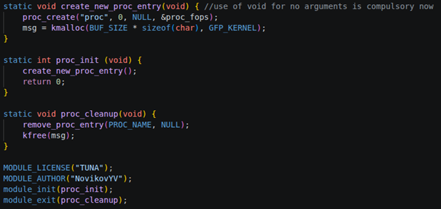
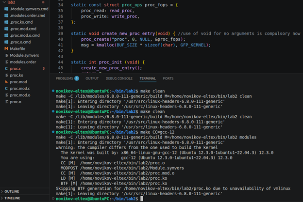
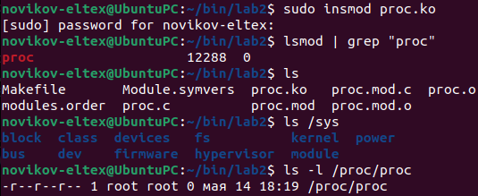
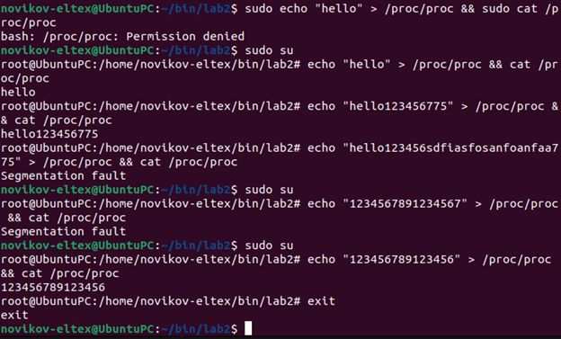
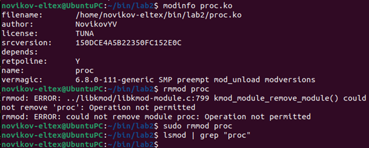

# Lab2, Module 5, Novikov

Собираем оригинальный код и выходит куча предупреждений.

Добавляем #define для избавления от магических чисел, добавляем static для глобальных переменных и методов.

А также меняем магические числа в коде на определённые в define + изменение названия лицензии и автора.

Очищаем прошлые файлы и собираем повторно. Теперь собирается без предупреждений.

Загружаем модуль в ядро и проверяем, что файл proc/proc появился.

Файл появился. Теперь попытка записать: под sudo не выходит, иду под root и успешно записываю. Методом проб и ошибок оказалось, что Segmentation fault возникает, если передать более 16 байт. Это связано с тем, что хоть мы и указали размер буфера 10 байт, фактически он преобразовался в минимальный доступный размер. В данном случае это 16 байт.

Далее смотрим описание модуля (автор и лицензия верные) и удаляем его из ядра.