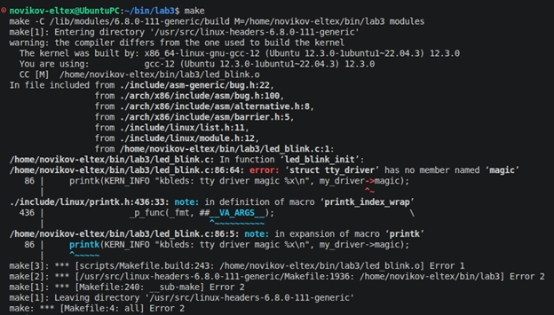
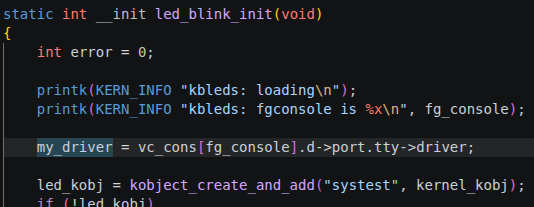
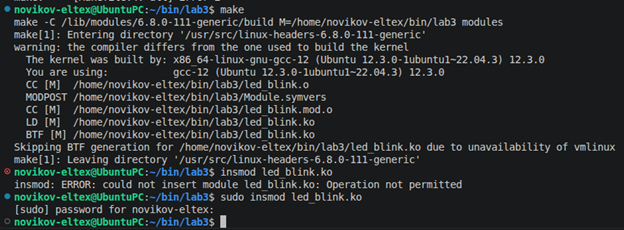
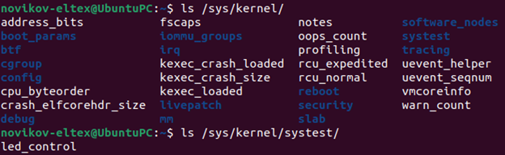
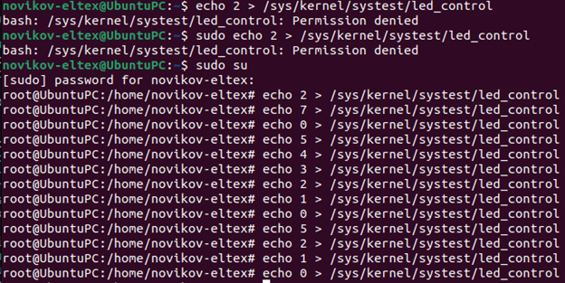
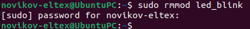

Пытаемся собрать модуль.

Не получилось из-за неизвестного magic. Удаляем его.

Скрин сверху - код с уже удалённым magic.

Повторно пытаемся собрать и загружаем модуль в ядро.

Всё получилось. Это же подтверждает наличие необходимого файла, через который будет происходить управление светодиодами.

Ниже - управление светодиодами.

Осталось удалить модуль из ядра.

