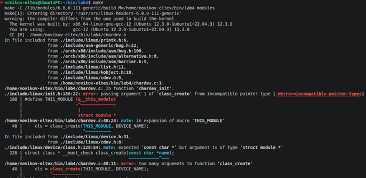
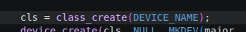
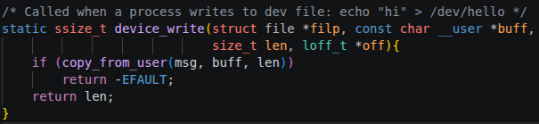
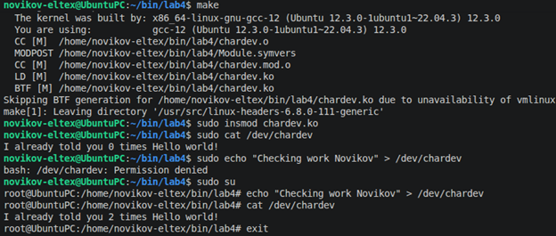
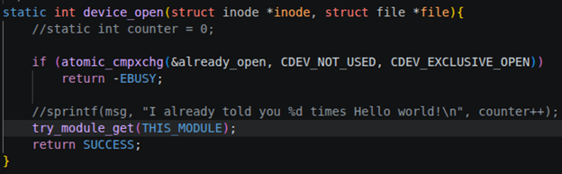
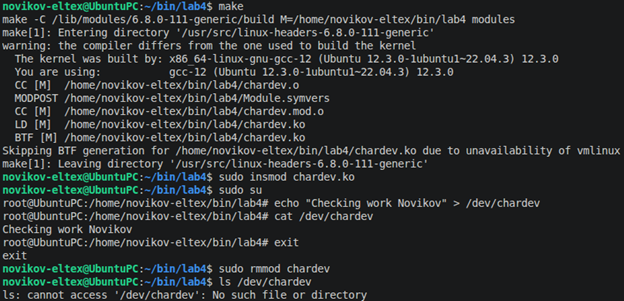

Сначала попытался собрать модуль, вышла ошибка.

Дело оказалось в том, что в class_create передавалось слишком много параметров. Код был исправлен.

Была добавлена реализация операции записи.

Модуль успешно собрался, проверим его работу.

Как видно из проверки, записанные данные не сохраняются. Вероятно, функция чтения перезаписывает его. Исправим это.

Фактически закомментил ненужные строки.

Теперь снова соберём модуль и проверим его работу.

Теперь наше сообщение не перезаписывается: записанное сообщение осталось. После удаления модуля из ядра, соответствующая директория также была удалена.