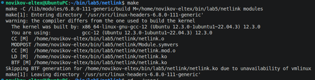
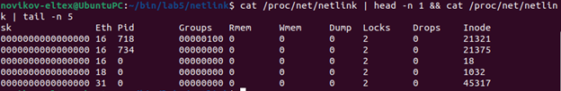
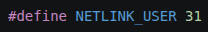
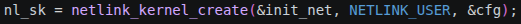
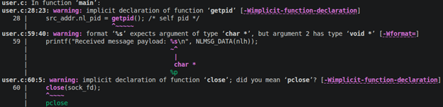
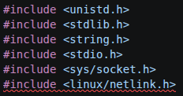
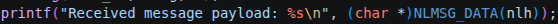
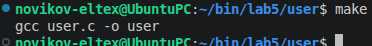
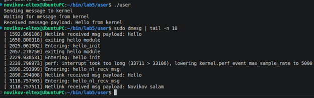
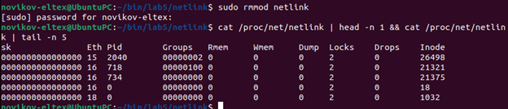

Попробуем собрать модуль.

Модуль был успешно собран без ошибок и предупреждений. Теперь загрузим модуль в ядро и проверим наличие созданного сокета.

Как видно из вывода, существует сокет ядра (pid 0) с Eth = 31. Именно с таким номером Netlink-протокола и создавался наш сокет в программе.

Следовательно наш модуль успешно создал сокет netlink.

Теперь разберёмся с пользовательской программой, через которую и будет происходить общение.

При сборке вышло 3 предупреждения. Давайте исправим это.
Добавлена библиотека <unistd.h> для getpid() и close().

И выполнено явное приведение к типу.

Теперь собралось без предупреждений:

Запустим пользовательское приложение и проверим логи.

Как видно по логам, сокет успешно получил сообщение «Novikov salam», а ядро ответило сообщением «Hello from kernel» (ответ от ядра оставил неизменным). Общение через сокет netlink прошло успешно.

Также подмечу, что после удаления модуля из ядра наш сокет (Eth 31) также был удалён.

