Соберём модуль.

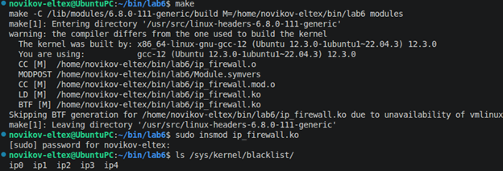

Модуль собрался без ошибок и предупреждений. После загрузки модуля в ядро была создана директория blacklist. В ней набор файлов, каждый файл из которого – это отдельный ip-адрес.

Дальше для тестирования работы модуля выполним ряд настроек. Для начала включим сетевой мост на ВМ, чтобы хост и ВМ смогли общаться друг с другом.

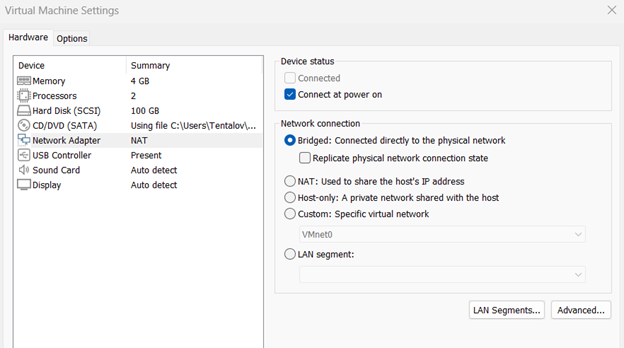

Ниже – ip хоста (на ноуте винда).

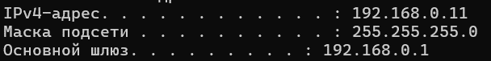

И ip ВМ.

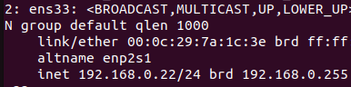

Пингуем гугл, успешно.

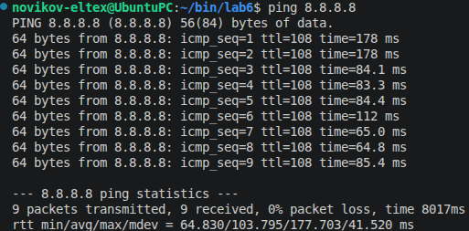

Пингуем ВМ с хоста, успешно.

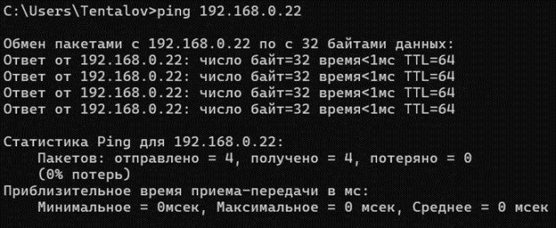

Теперь добавим эти ip в blacklist.

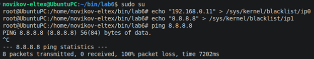

Теперь гугл с ВМ не пингуется (картинка выше), и сама ВМ не отвечает на пинги от хоста (картинка ниже).

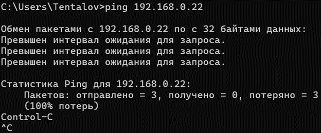

Логи подтверждают, что пакеты были отброшены для обоих адресов.

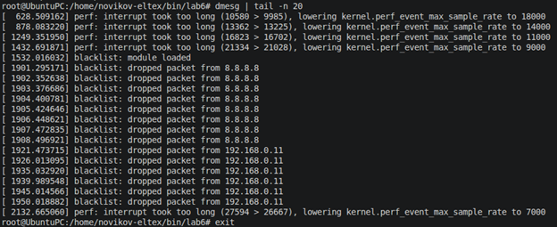

Теперь удалим модуль и снова проверим доступность адресов.

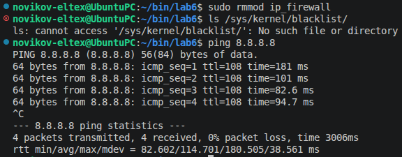

Всё вернулось на круги своя (см. рисунки выше и ниже).

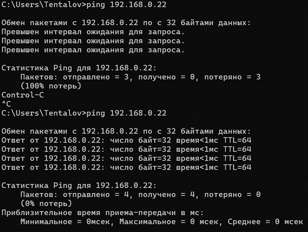